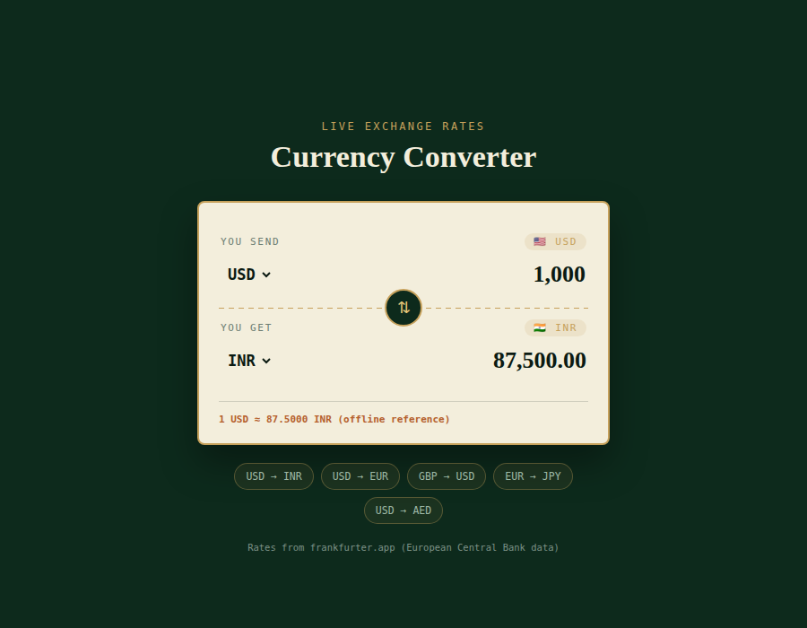

#  Currency Converter

A clean, banknote-inspired currency converter that fetches **live exchange rates** and converts between 12+ world currencies in real time.

**🔗 Live demo:** (https://preetham-adithya.github.io/Currency-Calci/)



## Features

- Convert between 12 major currencies with flag badges
- One-click swap between "from" and "to" currencies
- Quick-pick shortcuts for popular currency pairs (USD → INR, GBP → USD, etc.)
- Fully responsive — works on mobile and desktop
- Built with plain HTML, CSS, and JavaScript — no frameworks, no build step

## Tech Stack

- **HTML5** — page structure
- **CSS3** — banknote-themed design (custom properties, flexbox)
- **JavaScript (vanilla)** — fetches rates and handles conversion logic
- **Google Fonts** — Fraunces, Inter, JetBrains Mono
- **frankfurter.app** — free exchange rate API (European Central Bank data)

## Project Structure

```
currency-converter/
├── index.html      
├── style.css        
├── script.js         
├── preview.png       
└── README.md
```

## Running Locally

No installation needed — it's plain HTML/CSS/JS.

1. Clone or download this repository
2. Open `index.html` in browser

That's it. An internet connection is needed for it to fetch live rates.

## Deployment

This project is deployed for free using **GitHub Pages**. See the steps in the setup guide, or:

1. Push the code to a GitHub repository
2. Go to **Settings → Pages**
3. Set the source branch to `main` and folder to `/ (root)`
4. Your site goes live at `https://preetham-adithya.github.io/Currency-Calci/`


## License

This project is open source and available under the [MIT License](LICENSE).
